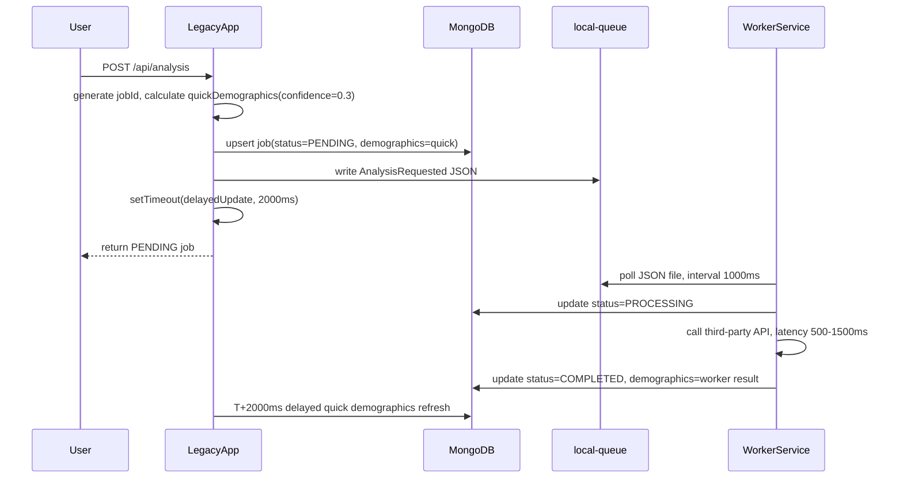

# Part 2: 客服工单 #4521 — 系统认知报告

## 1. 数据生命周期图

一个 `AnalysisJob` 的创建和异步处理路径如下：



关键时间窗口：

| 时间 | 发起方 | 操作 | 结果 |
|------|--------|------|------|
| T+0ms | LegacyApp | 创建 quick demographics | `confidence=0.3`, `status=PENDING` |
| T+0ms | LegacyApp | `saveJob` 写入 MongoDB | 用户可以立即查到临时结果 |
| T+0ms | LegacyApp | 发布 `AnalysisRequested` 到本地队列 | Worker 后续消费 |
| T+0ms | LegacyApp | 安排 2000ms 后的 `delayedUpdate` | 闭包捕获旧的 quick demographics |
| T+1000ms 左右 | WorkerService | 轮询到队列文件 | 开始正式处理 |
| T+1000ms 左右 | WorkerService | 更新 `status=PROCESSING` | job 已离开初始状态 |
| T+1500-2500ms | WorkerService | 写入正式结果 | `status=COMPLETED`, 可能 `confidence=0.85` |
| T+2000ms | LegacyApp | delayed update 尝试写 quick demographics | 修复前会覆盖；修复后仅 `PENDING` 时允许写 |

如果 Worker 在 T+2000ms 前完成，就会出现用户先看到 `confidence=0.85`，刷新后又看到 `confidence=0.3` 的数据倒退。

## 2. 字段语义分析

| 字段 | 理解 |
|------|------|
| `status: PENDING` | job 已创建，等待 Worker 正式处理；LegacyApp 的 quick demographics 可以作为临时展示。 |
| `status: PROCESSING` | Worker 已接管任务，正在调用第三方分析链路；LegacyApp 不应再覆盖分析字段。 |
| `status: COMPLETED` | Worker 已写入正式分析结果；这是用户报告应展示的数据。 |
| `demographics.confidence` | 受众画像结果可信度。`0.3` 是低置信度 quick estimate，`0.85` 是更高置信度的正式分析结果。 |
| `demographics.gender` | 受众性别画像，不是用户本人的性别。 |
| `demographics.ageRange` | 受众年龄段桶，例如 `25-34`。 |
| `confidence: 0.85 -> 0.3` | 正式结果被旧的临时结果覆盖，属于数据一致性倒退。 |

## 3. 根因假设

我无法从现有代码确认 `delayedUpdate` 的原始业务意图。基于注释，它可能是为了确保 preliminary demographics 在创建后短时间内被持久化。

确定的系统事实是：

- LegacyApp 在 `apps/legacy-app/src/analysis/analysis.service.ts:36` 生成 `quickDemographics`，置信度固定为 `0.3`。
- LegacyApp 在 `apps/legacy-app/src/analysis/analysis.service.ts:65` 安排 2 秒后的 `delayedUpdate`，闭包捕获的是创建时的旧 quick result。
- Worker 在 `apps/worker-service/src/processors/analysis.processor.ts:39` 将状态更新为 `PROCESSING`。
- Worker 在 `apps/worker-service/src/processors/analysis.processor.ts:48` 写入正式结果，并在 `apps/worker-service/src/processors/analysis.processor.ts:153` 将状态设为 `COMPLETED`。
- 修复前，LegacyApp 的 delayed update 无条件调用 `updateJob`，会覆盖 Worker 已写入的 `demographics`。

根因不是 `setTimeout` 或闭包本身，而是一个低优先级旧快照写入缺少状态约束，跨过服务职责边界覆盖了 Worker 的正式结果。

## 4. 修复方案

### 设计原则

保留 delayed update 可能存在的业务意图，但为它加上明确边界：

- LegacyApp 可以在 job 仍为 `PENDING` 时补写 quick demographics。
- 一旦 Worker 已将 job 推进到 `PROCESSING` 或 `COMPLETED`，LegacyApp 不再覆盖 `demographics`。
- 条件判断必须在 MongoDB update filter 中完成，避免先查后写的竞态。

### 具体修改

#### LegacyApp 修改

新增 `DatabaseService.updateJobIfStatus(jobId, expectedStatus, updates)`，底层使用原子条件更新：

```typescript
await collection.updateOne(
  { jobId, status: expectedStatus },
  { $set: { ...updates, updatedAt: new Date().toISOString() } },
);
```

`AnalysisService.delayedUpdate` 改为：

```typescript
await this.databaseService.updateJobIfStatus(jobId, 'PENDING', {
  demographics,
  updatedAt: new Date().toISOString(),
});
```

因此，2 秒后的补写只会在 job 仍处于初始待处理状态时生效。

#### WorkerService 修改

本次未修改 WorkerService。Worker 已经负责 `PENDING -> PROCESSING -> COMPLETED` 的正式处理链路；问题发生在 LegacyApp 的延迟旧写入缺少状态保护。

## 5. TDD 验证

新增测试：`apps/legacy-app/test/bug-repro.spec.ts`

测试场景：

1. 调用 `createAnalysis()` 创建 `PENDING + quickDemographics(confidence=0.3)`。
2. 在 2 秒 timer 触发前，模拟 Worker 写入 `COMPLETED + confidence=0.85`。
3. 推进 fake timer 到 2000ms。
4. 断言 job 仍保持 Worker 的正式结果。

修复前测试失败，证明 bug 存在：

```text
Expected confidence: 0.85
Received confidence: 0.3
```

修复后测试通过：

```bash
pnpm --filter legacy-app test -- --runInBand

PASS test/bug-repro.spec.ts
  Data Consistency (Bug Repro)
    ✓ does not let delayed quick demographics overwrite a completed worker result
```

构建验证：

```bash
pnpm --filter legacy-app build
```
