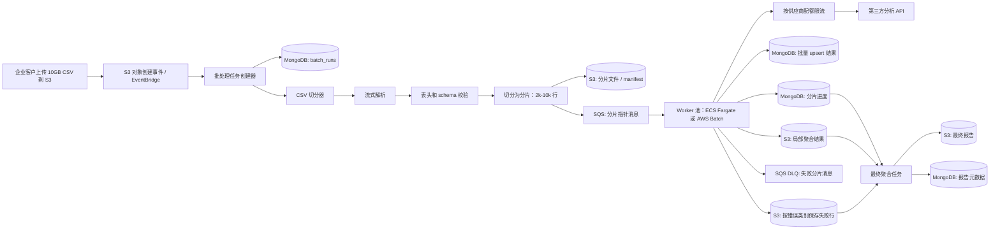

# Part 5: 系统设计与权衡

## 0. 结论

### 题目来源说明

README 的 Part 5 背景里明确写到：

```text
CTO 听说 Rust 很快，建议你用 Rust 重写 Worker，或者上 Kubernetes 做自动扩缩容。
```

同一段 README 的正式问题列表中，第 2 问更聚焦于：

```text
技术选型：你会接受 CTO 用 Rust 重写的建议吗？为什么？替代方案？
```

所以这份回答会重点回应 Rust 重写，同时也简要回应 README 背景中提到的 Kubernetes 自动扩缩容提议。

我不会把这个问题优先解成“Rust 重写”或“直接上 Kubernetes”。这不是一个单进程 CPU 性能问题，而是一个 **S3 大文件摄取、CSV 流式切分、队列 fan-out、第三方 API quota/latency、Mongo 批量写入、报告聚合和失败观测** 的端到端吞吐问题。

推荐的 2 周上线方案：

- 保留现有 TypeScript Worker 的业务逻辑和 Part 3 已建立的运行时校验、失败记录、结构化日志思路。
- 用 S3 接收原始 10GB CSV，并用 streaming parser 切成 shard/chunk。
- 队列消息不要按 500 万行逐条发送，而是发送分片指针。
- 用托管队列和托管计算承载并行处理，例如 SQS + ECS Fargate / AWS Batch。
- Worker 横向扩展，但必须受第三方 API quota 和 Mongo 写入能力约束。
- 结果写入使用幂等批量 upsert；报告生成先做分片级局部聚合，再做最终合并。
- 失败记录落 S3/DLQ，监控按运行批次、分片、错误类别聚合，而不是逐条报警。

这个方案的核心目标不是“把消息快速入队”，而是让每一行在 2 小时内变成以下两种“已核算”状态之一：

```text
成功处理
已分类失败，并带有可排查原因
```

## 1. 架构升级方案

### 吞吐量模型

基本数字：

```text
记录数 = 5,000,000
截止时间 = 2 小时 = 7,200 秒

最低所需吞吐 = 5,000,000 / 7,200
             = 694.44 条/秒
```

当前 Worker：

```text
当前吞吐 = 约 10 条/秒
2 小时处理能力 = 10 * 7,200 = 72,000 条
能力差距 = 5,000,000 / 72,000 = 69.44 倍
```

也就是说，当前单实例 2 小时只能处理约 7.2 万条，处理完 500 万条大约需要：

```text
5,000,000 / 10 = 500,000 秒
               = 138.9 小时
               = 5.8 天
```

694 条/秒只是理论下限。考虑 CSV 摄取、队列延迟、第三方 API 尾延迟、重试、Mongo 写入、报告聚合和部署抖动，我会按至少：

```text
持续核算吞吐 >= 900 条/秒
```

作为首版容量目标。

这里必须强调：**核算吞吐** 不是“入队速度”，而是：

```text
成功处理的行数 + 已明确分类为失败的行数
```

如果第三方 API 是逐条调用，并且平均延迟是 1 秒，那么仅 API 调用就需要：

```text
所需并发请求数 = 700 条/秒 * 1 秒
              = 约 700 个并发请求
```

如果 p95 延迟接近 1.5 秒，并发需求可能接近 1,000。这个瓶颈不是 Rust 或 Kubernetes 能单独解决的，必须提前确认第三方 API 的限流配额、批处理接口、超时和重试策略。

### 主要瓶颈

| 环节 | 风险 | 处理方式 |
|------|------|----------|
| CSV 摄取 | 10GB 文件不能一次性读入内存；按字节范围硬切可能破坏带换行或转义的 CSV 字段 | 使用流式 CSV 解析器，按完整记录切分片 |
| 队列分发 | 500 万条行级消息会增加队列成本和调试复杂度 | 队列消息代表分片指针，不代表单行 |
| 第三方 API | 最大上线前置风险；如果供应商不允许 700+ 条/秒或不支持批处理接口，SLA 不可达 | 上线前确认配额；优先批处理接口；Worker 做有界并发 |
| Mongo 写入 | 逐条 updateOne 会放大写入压力和尾延迟 | 每个分片内批量 upsert；减少索引写放大 |
| 报告聚合 | 不应在最后扫描 500 万明细生成报告 | 每个分片输出局部聚合，最终任务只合并摘要 |
| 可观测性 | 1% 失败就是 5 万条错误，不能逐条报警 | 错误分桶 + S3 失败行 + 采样日志 + 看板 |

### 架构图



### 核心数据流

1. **S3 ingestion**

   客户上传 CSV 到：

   ```text
   s3://analysis-input/{customerId}/{runId}/source.csv
   ```

   S3 event 或 EventBridge 创建 `BatchRun`，记录：

   ```text
   runId
   customerId
   sourceS3Key
   status = SPLITTING
   traceId
   startedAt
   ```

2. **CSV 流式解析 / 切分**

   切分器从 S3 流式读取 CSV，不把 10GB 文件整体加载到内存。它先校验表头和必需列，然后按完整 CSV 记录切分片。

   Shard 粒度可以先取：

   ```text
   shard size = 5,000 rows
   total shards = 5,000,000 / 5,000 = 1,000
   ```

   每个 shard 写到 S3：

   ```text
   s3://analysis-runs/{runId}/shards/shard-000001.jsonl
   ```

   同时写 manifest：

   ```json
   {
     "runId": "run-2026-06-13-enterprise-a",
     "totalRows": 5000000,
     "totalShards": 1000,
     "shardSize": 5000,
     "schemaVersion": 1
   }
   ```

3. **队列分发**

   SQS 消息只保存分片指针：

   ```json
   {
     "eventType": "AnalysisShardRequested",
     "schemaVersion": 1,
     "runId": "run-2026-06-13-enterprise-a",
     "customerId": "enterprise-a",
     "shardId": "shard-000123",
     "shardS3Key": "analysis-runs/run-.../shards/shard-000123.jsonl",
     "rowStart": 615000,
     "rowEnd": 619999,
     "attempt": 1,
     "traceId": "trace-run-..."
   }
   ```

   这样队列只需要处理约 1,000 条分片消息，而不是 500 万条行级消息。行级处理在 Worker 内部完成。

4. **可水平扩展的 Worker**

   Worker 从 SQS 拉取分片，下载对应 JSONL，逐行处理。每个 Worker 内部做有界并发，不能无限制调用第三方 API。

   假设单 Worker 仍然稳定 10 条/秒：

   ```text
   最少 Worker 数 = 695 / 10 = 69.5
   更现实的初始上限 = 90-120 个 Worker
   ```

   但真实 Worker 数必须受供应商配额限制：

   ```text
   供应商最大请求速率 = 已确认配额
   单 Worker 并发 = floor(供应商最大请求速率 / 活跃 Worker 数)
   ```

   如果供应商支持批处理接口，应优先使用。例如：

   ```text
   每次供应商请求处理 100 条
   700 条/秒 = 7 次供应商批处理请求/秒
   ```

   这比 700 个单条请求/秒现实很多。

5. **幂等性**

   SQS 是“至少投递一次”的语义，Worker 崩溃或 visibility timeout 都可能导致重复投递。因此首版不追求昂贵的分布式 exactly-once，而是用确定性的 key 做幂等：

   ```text
   shardKey = runId + shardId
   recordKey = hash(runId + sourceRowNumber + stableExternalId)
   providerRequestKey = hash(provider + normalizedInput)
   ```

   Mongo 写入使用批量 upsert：

   ```typescript
   bulkWrite([
     {
       updateOne: {
         filter: { runId, recordKey },
         update: {
           $setOnInsert: { createdAt },
           $set: { normalizedResult, status, updatedAt }
         },
         upsert: true
       }
     }
   ])
   ```

   Shard 状态更新也要用条件更新，避免旧 retry 覆盖新状态：

   ```text
   PENDING -> PROCESSING -> COMPLETED / COMPLETED_WITH_ERRORS / FAILED
   ```

6. **报告聚合**

   Worker 不只写单行结果，也写每个分片的局部聚合：

   ```json
   {
     "runId": "run-123",
     "shardId": "shard-000123",
     "processed": 5000,
     "succeeded": 4930,
     "failed": 70,
     "ageBuckets": { "18-24": 1200, "25-34": 2100 },
     "genderBuckets": { "female": 2600, "male": 2100, "other": 230 },
     "countryBuckets": { "US": 3000, "CA": 500 }
   }
   ```

   最终聚合任务只合并分片摘要，不重新扫描 500 万行明细。

   最终状态：

   ```text
   COMPLETED              = 所有分片完成，且没有关键行级失败
   COMPLETED_WITH_ERRORS  = 所有行都已核算，但存在部分分类失败的行
   FAILED                 = 分片缺失、供应商故障，或报告质量低于阈值
   ```

### 核心改动点

1. **替换本地队列边界**

   当前 `local-queue/` 只是 SQS 的本地模拟。生产方案中，`MessageQueueService` / `QueuePoller` 背后的实现应该替换为 SQS 或托管队列，而不是继续扩展本地文件轮询。

2. **新增批处理/分片事件**

   当前 `AnalysisRequestedEvent` 只描述单个 job：

   ```text
   jobId, userId, dataUrl, timestamp, traceId
   ```

   Part 5 需要新增类似 `AnalysisShardRequested` 的事件，包含：

   ```text
   runId, shardId, shardS3Key, rowStart, rowEnd, attempt, traceId, schemaVersion
   ```

3. **把 processor 拆成单行处理和分片处理**

   当前 `AnalysisProcessor.process(event)` 是单 job 处理。批处理场景下，应抽成：

   ```text
   processOneRecord(record, context)
   processShard(shardPointer, context)
   ```

   `processOneRecord` 复用 Part 3 的校验、规范化、degraded/rejected 分类和第三方响应处理；`processShard` 负责流式读取行、并发控制、批量写入、失败行和局部聚合。

4. **批量写入和分层存储**

   Mongo 保存：

   ```text
   batch_runs
   shard_progress
   row result / summary metadata
   final report metadata
   ```

   S3 保存：

   ```text
   原始 CSV
   分片文件
   局部聚合结果
   失败行
   最终报告
   ```

   不把所有中间大对象塞进 Mongo。

5. **保留可观测性，但改变粒度**

   Part 3 的失败记录思路是正确的，但 5 万条失败不能继续每条写一个本地小文件。大规模版本应该按：

   ```text
   runId / shardId / errorCategory
   ```

   聚合到 S3 JSONL 和看板。

## 2. 对 CTO 建议的回应

### Rust 重写

我不会把 Rust 重写放进 2 周上线主路径。

但这个判断不是因为 Rust 不好，也不是因为 AI 辅助下重写永远不可行。现在 AI 确实降低了重写成本：如果边界清晰、测试充分、接口契约稳定，重写一个 CSV 切分器、协议适配器或 CPU 密集型转换模块的难度比过去低很多。

问题在于：**AI 降低迁移成本，但不能改变瓶颈位置。**

本题的关键瓶颈大概率不是 TypeScript CPU 性能，而是：

- 10GB CSV 如何可靠流式摄取
- 500 万行如何分片、排队、重试、去重
- 第三方 API 是否支持 700+ 条/秒或批处理接口
- Mongo 如何批量写入，避免逐条写放大
- 最终报告如何通过局部聚合降低尾延迟
- 5 万条失败如何聚合、采样、定位，而不是淹没日志系统

Rust 可能改善单个 Worker 的 CPU 成本，但不能让第三方 API 配额变大，也不能自动解决幂等、DLQ、聚合和可观测性。

我会这样回应 CTO：

> 我不会把这次 2 周 Enterprise 上线预算花在 Rust 重写上。AI 辅助确实会在契约稳定、测试充分时降低迁移成本，但它不会改变瓶颈位置。这个需求的目标是约 700 条/秒的核算吞吐，主风险是外部 I/O、供应商限流、队列分发、Mongo 写放大、重试和聚合正确性。Rust 可以是 profiling 证明 CPU hot path 后的未来优化，但不是这次 SLA 的第一步。

可接受的中期路径：

- 如果 profiling 证明 CSV 解析或某段转换逻辑是 CPU 密集型，可以用 AI 辅助重写局部 hot path。
- 如果要重写，先冻结输入/输出契约，补 characterization tests，再做双写或影子运行。
- 不在 2 周首版里全量重写 Worker。

### Kubernetes 自动扩缩容（README 背景中的另一个 CTO 提议）

我也不会把“从零上 Kubernetes”作为首选方案。

Kubernetes 能回答：

```text
如何运行更多 worker
```

但它不能自动回答：

```text
如何切分 CSV
如何做反压
如何做幂等 upsert
如何按供应商配额限流
如何处理 DLQ
如何聚合报告
如何避免 5 万条错误报警
```

1 个后端 2 周内从零引入 Kubernetes、HPA/KEDA、指标、日志、密钥、网络、发布流程，是平台迁移，不是业务交付。

更现实的替代方案：

```text
TypeScript Worker
+ SQS 分片队列
+ ECS Fargate / AWS Batch / 已有计算平台
+ 按供应商配额限流
+ S3 失败行 / 局部聚合
+ Mongo 进度元数据
```

如果公司已经有成熟 Kubernetes 平台、KEDA/SQS 自动扩缩容、日志监控、CI/CD 和 SRE 支持，那么可以把 Worker 池部署在现有 K8s 上。但 Part 5 的核心方案仍然是基于分片的批处理流水线，而不是 Kubernetes 本身。

## 3. 2 周冲刺中的妥协

### 主动放弃的最佳实践

| 放弃项 | 原因 | 临时替代 |
|--------|------|----------|
| Rust 全量重写 | 收益不对当前瓶颈，2 周风险高 | 保持 TypeScript；只优化流式读取、批量写入、并发控制 |
| 从零引入 Kubernetes | 平台面太大，1 人 2 周不现实 | 使用 ECS Fargate / AWS Batch / 已有托管计算 |
| 完整 data lake / Spark / Flink | 对每周一个 10GB CSV 过度设计 | S3 分片 + 局部聚合 + 最终聚合任务 |
| 分布式 exactly-once 处理 | 成本过高 | 至少投递一次的队列 + 确定性幂等 key + upsert |
| 复杂实时 UI | 不影响首版 SLA | 批处理状态、ETA、看板、runbook 先满足运营/研发 |
| 每行实时状态查询 | 500 万高基数字段会拖垮 Mongo 和日志系统 | 分片进度 + 采样失败行 |
| 每条失败独立报警 | 1% 失败就是 5 万条 | 错误分桶 + 聚合报警 |
| 多区域容灾 | 首版 scope 过大 | 单区域可观测、可重试、可补偿 |
| 完整 schema registry | 两周内过重 | 带版本的 CSV 表头 + 运行时校验 |
| 完美自助 replay UI | 非上线必要 | 保留 runId/shardId，可通过内部工具重放分片 |

### 不能放弃的能力

| 必须保留 | 原因 |
|----------|------|
| 流式 CSV 解析器 | 10GB 文件不能整体读入内存；错误切分会破坏 CSV 记录 |
| 分片 manifest | 没有 manifest 就不知道应该完成多少分片 |
| 分片级幂等 | 队列重试 / Worker 崩溃一定会造成重复投递 |
| 行级校验 | Part 3 已证明第三方/输入数据会脏，坏记录不能拖垮整个批次 |
| 按供应商配额限流 | 不限流会触发 429，反而降低吞吐 |
| Mongo 批量写入 | 逐条写会放大尾延迟和数据库压力 |
| DLQ / 失败行 | 失败分片和失败行必须隔离、可重放、可解释 |
| 带 `runId/shardId/traceId` 的结构化日志 | 没有关联键就无法排查 |
| 进度 / ETA 指标 | 2 小时 SLA 必须能提前发现赶不上 |
| 局部聚合 | 最终报告不能依赖扫描全部 500 万明细 |

### 两周交付拆分

| 时间 | 交付内容 |
|------|----------|
| 第 1-2 天 | 定义 `BatchRun`, `AnalysisShardRequested`, 分片状态、幂等 key；确认第三方 API 配额 / 批处理接口 |
| 第 3-5 天 | S3 摄取 + 流式切分器 + 分片 manifest + SQS 分发 |
| 第 6-8 天 | Worker 改造成分片处理器；加入有界并发、批量写入、分片级重试 |
| 第 9-10 天 | DLQ / S3 失败行 / 错误分桶 / 采样日志 |
| 第 11-12 天 | 局部聚合 + 最终报告生成器 |
| 第 13-14 天 | 看板、runbook、容量参数固化、故障演练和 bugfix 缓冲 |

这个计划的范围要非常明确：**只做 Enterprise 每周批处理路径，不重写普通实时分析路径。**

## 4. 大规模错误的调试策略

### 1% 失败 = 50,000 条错误

不能做：

```text
50,000 条行级失败
=> 50,000 条错误日志
=> 50,000 个报警
```

应该做：

```text
50,000 条行级失败
=> S3 失败行
=> 聚合计数
=> 高频错误类别
=> 采样样本
=> 低基数报警
```

### 错误分类

每个失败生成稳定的 `errorCategory` / `errorSignature`：

```text
errorSignature = hash(stage + errorName + normalizedReason + field + providerStatusCode)
```

示例 category：

```text
csv.malformed_row
csv.required_column_missing
validation.required_field_missing
validation.age.invalid
validation.gender.unsupported
validation.country.missing
third_party.timeout
third_party.rate_limited
third_party.bad_response_shape
third_party.validation_failed
mongo.bulk_write_failed
mongo.duplicate_key
worker.unhandled_exception
```

### 失败记录存储

行级失败写入 S3 JSONL，而不是集中式日志：

```text
s3://analysis-runs/{runId}/failed/
  category=validation.age.invalid/part-00001.jsonl
  category=third_party.timeout/part-00002.jsonl
  category=third_party.rate_limited/part-00003.jsonl
```

每条失败行保存精简记录：

```json
{
  "runId": "run-123",
  "shardId": "shard-000123",
  "rowNumber": 615432,
  "recordKey": "abc",
  "traceId": "trace-run-123",
  "category": "validation.age.invalid",
  "field": "age",
  "reason": "age must be numeric or parseable age range",
  "rawRecordRef": "s3://analysis-runs/run-123/failed/category=validation.age.invalid/part-00001.jsonl"
}
```

对于 PII 或大字段：

- 日志只存 hash、length、field name。
- S3 失败行可以保存脱敏后的原始记录。
- 不把完整原始行或供应商响应打进集中式日志。

### Shard summary

每个 shard 输出一条 summary log：

```json
{
  "level": "warn",
  "event": "analysis_shard_completed_with_errors",
  "runId": "run-123",
  "shardId": "shard-000123",
  "traceId": "trace-run-123",
  "rowStart": 615000,
  "rowEnd": 619999,
  "processed": 5000,
  "succeeded": 4930,
  "failed": 70,
  "durationMs": 420000,
  "failureCounts": {
    "validation.age.invalid": 30,
    "third_party.timeout": 25,
    "validation.gender.unsupported": 15
  },
  "sampleFailures": {
    "validation.age.invalid": [
      { "rowNumber": 615001, "reason": "age must be numeric" }
    ]
  }
}
```

看板展示高频错误类别，而不是展示全部失败行：

```text
validation.age.invalid: 18,420
validation.gender.missing: 9,100
third_party.rate_limited: 7,800
third_party.timeout: 6,200
mongo.bulk_write_failed: 500
unknown: 120
```

### 看板

至少要能回答这些问题：

| 问题 | 指标 |
|------|------|
| 现在赶得上 2 小时吗？ | ETA、处理速度、剩余行数、队列最老消息年龄 |
| 是哪里慢？ | CSV 切分耗时、队列深度、活跃 Worker 数、API p50/p95/p99、Mongo 批量写入延迟 |
| 失败是否异常？ | 失败行数、失败率、失败分片数、DLQ 深度 |
| 失败主要是什么？ | 高频错误类别、新错误类别、错误类别趋势 |
| 是否被第三方卡住？ | 429 比例、5xx 比例、超时比例、重试次数 |
| 是否有写入瓶颈？ | Mongo 写入延迟、批量写入错误数 |
| 报告能否生成？ | 已完成分片数 / 总分片数、局部聚合就绪数量 |

### 报警策略

只对聚合信号报警：

| 报警 | 条件 |
|-------|------|
| SLA 风险 | ETA > 120 分钟，或队列最老消息年龄持续增长 |
| 无进展 | 已处理数量 N 分钟不增长 |
| 失败率突增 | 行级失败率 > 2% 持续 10 分钟 |
| 新高频错误类别 | 新错误类别快速增长 |
| 供应商降级 | 429/timeout/5xx 超阈值 |
| DLQ 增长 | DLQ 分片数 > 0 或持续增长 |
| Mongo 降级 | 批量写入延迟 / 错误率超阈值 |
| 最终聚合卡住 | 所有分片进入终态后，最终聚合任务未启动或未完成 |

不报警：

- 单条校验失败。
- 已知错误类别内的低比例永久坏数据。
- 已经写入失败行且不影响 SLA 的错误样本。

### SLO

首版 SLO 可以定义为：

```text
Enterprise 每周批处理：
- 99% 的已接受有效行在 2 小时内处理完成。
- 在供应商配额满足要求的前提下，100% 的行在 2 小时内成功处理或被分类为失败。
- 最终报告在 2 小时内生成。
- 行级失败报告包含高频错误类别和样本。
```

这里的关键是：如果原始 CSV 或第三方响应有脏数据，正确行为不是卡住整个批次，而是分类失败、进入失败行，并在最终报告中清楚展示。

## 5. 验收标准和风险

### 验收标准

| 类型 | 标准 |
|------|------|
| 吞吐 | 持续核算吞吐 >= 900 条/秒 |
| 完成度 | 500 万行在 120 分钟内全部成功处理或分类失败 |
| 摄取 | 10GB CSV 流式切分，不出现全文件内存加载 |
| 队列 | SQS 消息是分片指针，不是行级 payload |
| 幂等 | 同一个分片重试不产生重复结果或重复聚合 |
| DLQ | 分片多次失败后进入 DLQ，不阻塞其他分片 |
| 可观测性 | 看板能看到 ETA、队列深度、高频错误类别 |
| 失败规模 | 5 万条行级失败不产生 5 万个报警 |
| 报告 | 最终报告来自局部聚合，可追溯到 runId/shardId |
| 可排查性 | 任一高频错误类别可定位样本行、原始原因、供应商响应引用 |

### 风险和缓解

| 风险 | 影响 | 缓解 |
|------|------|------|
| 第三方 API 配额 < 700 条/秒 | 无法满足 2 小时 SLA | 上线前确认配额；优先批处理接口；必要时调整 SLA |
| 供应商尾延迟太高 | 末尾分片拖延 | 小分片、超时控制、有界重试、允许局部完成 |
| Mongo 写入吞吐不足 | Worker 堆积 | 批量写入、减少索引、避免热点文档、局部聚合写 S3 |
| 行级消息过多 | 队列成本和调试复杂度高 | 队列只发分片指针 |
| 单个分片太大 | 重试成本高 | 分片大小控制在 2k-10k 行，根据耗时调整 |
| CSV schema 变更 | 大批失败 | ingestion 阶段 header validation，schemaVersion，早失败 |
| 失败日志爆炸 | 排障困难且成本高 | 错误类别计数 + S3 失败行 + 采样日志 |
| Worker 崩溃导致重复处理 | 重复数据和重复聚合 | 确定性 recordKey + 幂等 upsert + 分片条件状态更新 |

## 6. 面试官可能追问的问题

| 质疑 | 回答 |
|------|------|
| “多开 worker 就能 70 倍吗？” | 不能假设。70 倍只是数学下限，真实吞吐由供应商配额、Mongo 批量写入、队列堆积时间、聚合共同决定，所以方案必须有限流和反压。 |
| “为什么不是 500 万条 SQS 消息？” | 首版用分片消息控制成本和可观测性；行级失败在分片内记录到 S3 失败行。 |
| “CSV 切分会不会切坏带换行的字段？” | 不按字节偏移硬切；用流式 CSV 解析器按完整记录切分片。 |
| “第三方 API 配额不够怎么办？” | 如果供应商配额小于目标吞吐，任何语言/平台都无法满足 SLA；必须拿到配额、批处理接口，或调整 SLA。 |
| “Mongo 能不能承受 700 次写入/秒？” | 不做逐条同步 update；用批量写入，减少索引，局部聚合写 S3，Mongo 主要保存进度和元数据。 |
| “1% 失败怎么看？” | 不看 5 万条日志；看错误类别计数、高频字段、样本行和 S3 失败行。 |
| “两周真的能做完吗？” | 只做一个受控的 Enterprise 每周批处理路径，不改普通实时分析路径，不引入 Rust/K8s/完整 data lake/复杂 UI。 |

一句话总结：

> 目标是约 700 条/秒的核算吞吐，而不是 700 条/秒的入队速度。我会交付一个基于分片、至少投递一次、通过幂等保证正确性、有界并发、聚合观测的批处理流水线，而不是在两周内尝试 Rust 重写、新建 Kubernetes 平台或追求分布式 exactly-once。
